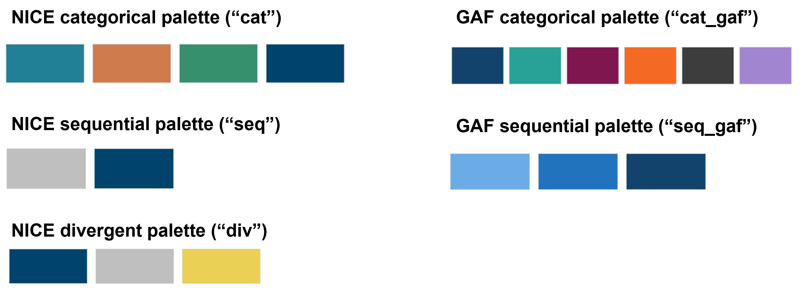

```{r setup, include=FALSE}
knitr::opts_chunk$set(echo = TRUE, message = FALSE, warning = FALSE)
knitr::opts_chunk$set(dev = "ragg_png")
here::i_am("vignettes/NICE_cookbook.Rmd")

```

# Introduction and set up

The `niceRplots` package and cookbook make the process of creating publication-ready graphics in the NICE style a more reproducible process, as well as making it easier for people new to R to create graphics.

Within this cookbook, we will demonstrate how to use the functions included within the `niceRplots` package, and provide examples of plots that have been created in the NICE style. The plots in this cookbook has been created using two graphing packages. The [ggplot2 package](https://ggplot2.tidyverse.org/) is used to create static plots, while the [plotly package](https://plotly.com/r/) is used to create interactive plots. We have also included an example choropleth map (heatmap) that has been created using the [leaflet package](https://rstudio.github.io/leaflet/). Navigate to the relevant section to view the code used to create these charts. <br>

## Installing the niceRplots package

The `niceRplots` package is not on CRAN, so it will need to be installed directly from [GitHub](https://github.com/) using the `devtools` package.

If you do not have the `devtools` package installed, you will also need to run the first line in the code below.

```{r pkg_install, eval = FALSE}

# Install the devtools package if you don't already have it installed
install.packages("devtools")

# Install the niceRplots package
devtools::install_github("NICE-Data-and-Analytics/niceRplots")

```

## Contents of the niceRplots package

The `niceRplots` package contains four functions and five data objects:

**Functions**

-   `nice_gg_theme()` - applies a theme to a `ggplot2` chart object to make it consistent with the NICE style.
-   `nice_plotly_theme()` - applies a theme to a `plotly` chart object to make it consistent with the NICE style.
-   `nice_cols()` - used to select colours from the [NICE brand palette](https://indepth.nice.org.uk/our-brand/index.html) by name.
-   `nice_pal()` - used to select primary palettes created using the NICE brand colours, or secondary palettes recommended by the Government Analysis Function (GAF).

**Data objects**

These have been included primarily for demonstration purposes in the present cookbook.

-   `anticoag_df` - A data frame showing monthly primary care dispensing of 5 anticoagulant medicines for all 106 sub-ICB locations in England between October 2017 and September 2022. This was downloaded from [OpenPrescribing.net](https://openprescribing.net/).
-   `sub_icb_shapes_2022` - A data frame containing the April 2022 polygon boundaries for all 106 sub-ICB locations in England.
-   `england_shape_2022` - A single polygon containing the boundary for England, created by merging the polygons for all sub-ICB locations.
-   `nice_colours` - A named vector of names and hex codes for all NICE brand colours.
-   `gaf_colours` - A named vector of names and hex codes for Government Analysis Function (GAF) chart colours.

Detailed information on each of these functions and data objects can be found by typing `?name` into the R console e.g. `?nice_gg_theme()` or `?anticoag_df`. <br>

## Load in relevant packages

Before we can start making charts, we first need to load all of the relevant packages. We won't load every package here, just the ones that we will use the most often. It is good practice to limit the number of loaded packages to prevent masking conflicts. For this reason, we will often use double colons `::` to access specific functions within a package (e.g. `readr::read_csv()`), rather than loading the full package using `library(pkg)`.

```{r pkg_load}

# Load in the relevant packages
library(dplyr)
library(svglite)
library(sf)
library(ggplot2)
library(leaflet)
library(plotly)
library(niceRplots)

```

## Load in data

Throughout this cookbook we will use two datasets for our example charts. The first is R's built in `iris` dataset, and the second is the `anticoag_df` dataframe that comes built into the `niceRplots` package. You can find detailed information on these datasets by typing `?iris` or `?anticoag_df` into the R console.

As the `anticoag_df` comes pre-loaded with the `niceRplots` package, we don't need to load this in. The code below demonstrates how we would usually load data into R.

```{r load_data, eval = FALSE}

# Load in data and specify column types 
# (D = date, d = double, i = integer, c = character, l = logical) 

example_df <- readr::read_csv("example_data.csv",
                            col_types = "Dccdd")

```

## Change RStudio graphic device

In order to use the NICE fonts within our charts, we first need to change the graphics device used by RStudio. To do this, install the `ragg` package with the below code:

```{r ragg_install, eval = FALSE}

install.packages("ragg")

```

Then restart R by clicking *Session \> Restart R*, and change the graphic device by clicking *Tools \> Global options \> General \> Graphics \> Backend: AGG \> Apply*

# Chart accessibility

By law, all content published on public sector websites must meet the level A and AA success criterion in the [Web Content Accessibility Guidelines (WCAG) 2.1](https://www.w3.org/TR/WCAG21/). This includes charts and data visualisations.

This guide will not go into detail on the principles of chart accessibility as this has been thoroughly covered elsewhere. Listed below are several useful resources designed to help create accessible charts:

-   [Government Analysis Function - Data visualisation: charts](https://analysisfunction.civilservice.gov.uk/policy-store/data-visualisation-charts/)
-   [Office for National Statistics - Guidance for presenting data](https://style.ons.gov.uk/category/data-visualisation/)
-   [Office for National Statistics - Accessibility guidance](https://style.ons.gov.uk/category/accessibility/)

Many of the principles highlighted in these guides have been considered when developing the `niceRplots` package and visualisation cookbook.

## Titles and alternative text

When publishing charts on the web it is important to include all necessary information alongside the chart. These should be provided in the body of the page, rather than within the chart itself. All charts should be supplied with following 6 key elements:

-   **Title** - This should be concise and convey the main message of the chart.

-   **Statistical title** - This should have information on the statistical measure, the geographical coverage and the time period. This should also include a figure number if appropriate.

-   **Alternative text** - This should describe what you want users to understand from the chart. The Government Analysis Function [recommends](https://analysisfunction.civilservice.gov.uk/policy-store/data-visualisation-charts/#section-6) that where you want a user to to take away an overall understanding of the data, provide alt text as a text description in the body of the page, directly below the chart. The graph image should then be marked as decorative to be hidden from screen reader software. Refer to the [GAF accessibility guidance](https://analysisfunction.civilservice.gov.uk/policy-store/making-analytical-publications-accessible/#section-4) for more on alt text.

-   **Source** - This should detail the source of the data in the following format: [organisation] -- [publication or source of data]. e.g. NHS Digital - Hospital Episode Statistics. If all charts come from the same data source, this does not need to be repeated under each figure.

-   **Data download** - It is best practice to provide a way to download the data displayed in each chart, This should be displayed under that chart and include information on file type and size. The text used for the link should be specific to the chart e.g. 'Download the data for figure 1 (5kb CSV)'.

The figure below provides an example of how a chart should look when published:

<br>

#### **Apixaban was the most prescribed anticoagulant in 2021** {.unlisted .unnumbered}

##### Figure x: Total anticoagulant medicines dispensed in primary care in England, 2021

```{r access_eg, echo = FALSE}

anticoag_df %>% 
  filter(between(date, as.Date("2021-01-01"), as.Date("2021-12-31"))) %>% 
  group_by(chemical) %>% 
  summarise(items = sum(items)/1000000) %>% 
  ungroup() %>% 
  # Plot bars in decreasing order of items
  ggplot(aes(y = items, x = reorder(chemical, -items))) +
  # Add bars, add fill and border colours
  geom_col(fill = nice_cols("bold_teal_100"), 
           colour = nice_cols("white_100"), linewidth = 0.2) +
  # set y-axis limits and remove padding
  scale_y_continuous(expand = c(0,0), limits = c(0,8)) +
  # set x-axis labels to wrap to prevent overlapping
  scale_x_discrete(labels = function(x) {stringr::str_wrap(x, width = 10)}) +
  # Apply NICE theme
  nice_gg_theme(x_title = FALSE) +
  # Add labels
  labs(y = "Dispensed items (millions)")

```

A bar chart showing that apixaban was the most prescribed anticoagulant medicine in 2021 with close to 8 million items dispensed.

Source: Bennett Institute for Applied Data Science -- [OpenPrescribing](https://openprescribing.net/)

[Download data for figure x (5kb CSV)]

## NICE colours and palettes
For guidance on colour usage in charts, please refer to the guides below:

-   [Government Analysis Function - Data visualisation: colours](https://analysisfunction.civilservice.gov.uk/policy-store/data-visualisation-colours-in-charts/)
-   [Office for National Statistics - Using colours](https://style.ons.gov.uk/category/data-visualisation/using-colours/)

Above all, do not rely on colour alone to communicate information in a chart.

The `niceRplots` package includes two functions to assist with colour usage

### nice_cols() - Select NICE colours

The `nice_cols()` function can be used to select specific colours from the NICE brand palette. The below examples show some use cases:

Using the `nice_cols()` function without an argument will show all of the available NICE colours.

```{r nice_cols_all}

nice_cols()

```

You can then select specific colours by including the colour name as an argument. As in the example below, it is possible to select multiple colours by including more than one colour in the function. This will return hexidecimal codes for the specified colours, which can be used to add colour to a chart.

```{r nice_cols_specific}

nice_cols("bold_teal_100", "natural_tan_100", "balanced_green_100")

```

This function will be used throughout the remainder on the cookbook to select colours when creating charts. Examine the code above each chart for more example use cases.
<br>

### nice_pal() - Select premade palettes

The `nice_pal()` function is used to select one of five accessible palettes. These include:

-   Three primary palettes, using categorical, sequential and diverging schemes, that have been created using the NICE brand colours.
-   Two secondary palettes developed by the [Government Analysis Function (GAF)](https://analysisfunction.civilservice.gov.uk/policy-store/data-visualisation-colours-in-charts/#section-4), which use categorical and sequential schemes.

Compared to the NICE categorical palette, the GAF palette may be preferred as it includes more colour options, and when used in the order specified, all adjacent colours have a contrast ratio of at least 3 to 1 and appear distinct from each other in greyscale.

These palettes have been visualised below:




The below examples show some use cases of the `nice_pal()` function. Like the `nice_cols()` function, these will return hexidecimal codes for the specified colours, which can be used to add colour to a chart.

```{r nice_pal_cat}

nice_pal("cat")

```

Sequential and divergent palettes can be used within the `colorRampPalette()` function to create a palette with the desired number of shades. 

```{r nice_pal_seq}

# Creates a palette with 5 shades
colorRampPalette(nice_pal("seq"))(5)

# Creates a palette with 7 shades
colorRampPalette(nice_pal("seq"))(7)

```

The `nice_pal()` function has been used in several example charts later in this cookbook. Examine the code above each chart for more example use cases.

Each palette has been visualised below, showing the original colors, and how they would look to people with various colour vision deficiencies. It is important to ensure that you do not rely on colour alone to communicate information within a chart.

```{r nice_cols, out.width="50%", echo = FALSE}

colorspace::swatchplot(
  'NICE categorical ("cat")'  = nice_pal("cat"),
  cvd = c("protan", "deutan", "tritan", "desaturate")
)
colorspace::swatchplot(
  'NICE sequential ("seq")' = colorRampPalette(nice_pal("seq"))(5),
  cvd = c("protan", "deutan", "tritan", "desaturate")
)
colorspace::swatchplot(
  'NICE divergent ("div")' = colorRampPalette(nice_pal("div"))(5),
  cvd = c("protan", "deutan", "tritan", "desaturate")
)
colorspace::swatchplot(
  'GAF categorical ("cat_gaf")' = nice_pal("cat_gaf"),
  cvd = c("protan", "deutan", "tritan", "desaturate")
)
colorspace::swatchplot(
  'GAF sequential ("seq_gaf")' = colorRampPalette(nice_pal("seq_gaf"))(5),
  cvd = c("protan", "deutan", "tritan", "desaturate")
)
```

<br>

# Static charts

## The ggplot2 package

The [ggplot2 package](https://ggplot2.tidyverse.org/) can be used to create static charts in R. The sections below will demonstrate how to create a range of chart types using `ggplot2` and apply the NICE theme.

## How to style your charts

Using the `iris` dataset, we first create a basic chart (left), then recreate the chart with a NICE colour applied to the fill colour of the bars and adding a white border to the bars (right).

```{r format_chart}

# Wrangle data for plotting
iris_bar_df <- iris %>% 
  group_by(Species) %>% 
  summarise(Sepal_Width = mean(Sepal.Width)) %>% 
  ungroup()

# Create basic bar chart (left)
iris_bar <- ggplot(iris_bar_df) + 
  geom_col(aes(x = Species, y = Sepal_Width)) +
  labs(x = "Species",
       y = "Sepal Width")

# Create formatted chart (right)
iris_bar_formatted <- ggplot(iris_bar_df) + 
  # Adjust bar fill and outline colour
  geom_col(aes(x = Species, y = Sepal_Width), fill = nice_cols("bold_teal_100"), 
           colour = nice_cols("white_100"), linewidth = 0.2)+
  # Set y-axis limits and remove padding
  scale_y_continuous(expand = c(0, 0), limits = c(0, 4)) +
  # Add labels 
  labs(y = "Sepal width")
```

<br>

```{r format_chart_out, echo = FALSE, fig.show = "hold", out.width = "50%"}
iris_bar
iris_bar_formatted
```

<br>

We can now apply the NICE theme using the `nice_gg_theme()` function from the `niceRplots` package, specifying that we want to remove the x-axis title using the `x_title` argument.

```{r gg_theme_chart}

iris_bar_themed <- iris_bar_formatted +
  # Apply NICE theme, remove x-axis title
  nice_gg_theme(x_title = FALSE)
```

<br>

```{r gg_theme_chart_out, echo = FALSE}
iris_bar_themed
```

<br>

The `nice_gg_theme()` function alters several aspects of the chart to make it consistent with the [NICE brand guidelines](https://indepth.nice.org.uk/our-brand/index.html). These are as follows:

-   **Fonts**: text throughout the plot will be changed to the Inter Regular font. If a title is present, this will be changed to Lora SemiBold.

-   **Text sizing**: text throughout the chart can be resized using optional `base_size` argument (default is `12`). Any titles or subtitles will be automatically scaled relative to this base_size to maintain the text hierarchy.

-   **Colour scheme**: removes the grey background. Changes line and text colours to be consistent with the NICE brand colour palette. This is particularly noticeable when creating faceted charts (shown later in cookbook). It should be noted that this will not add colour to the plotted data, which will still need to be added manually when creating the chart. For instance, a fill colour was added in the `geom_col()` argument in the above example.

-   **Margins**: adjusts the margins around the title, subtitle, and axis titles to give everything space to breathe.

-   **Grid lines**: grid lines can be added or removed from the axes using the optional `grid_lines` argument (options are `"y"` (default), `"x"`, `"x+y"` and `"none"`). A panel border can also be added by setting the `panel_border` argument to `TRUE`.

-   **Axes**: axes titles can be removed by setting the `x_title` or `y_title` arguments to `FALSE` (default is `TRUE`). Axes ticks can be added or removed using the optional `axis_ticks` argument (options are `"x"` (default), `"y"`, `"x+y"` and `"none"`). Axes can be removed entirely by setting the `remove_axes` argument to `TRUE`.

-   **Legend**: remove the chart legend by setting the `show_legend` argument to `FALSE`.

The `nice_gg_theme()` function isn't designed to modify every aspect of the chart, but to apply a general consistent theme and provide options for the most common chart modifications. When making complex charts, many aspects of the chart will still need to be modified manually (see choropleth example). The remaining chart examples in this section will demonstrate several use cases of the `nice_gg_theme()` function.

## How to save your plots

Once we have styled our chart, we can save it using the `ggsave()` function. It is best practice to use the Scalable Vector Graphic (SVG) format when saving and publishing charts. This is because SVGs retain the same quality no matter what screen resolution or size they are viewed at. This improves accessibility as it allows users to zoom in and out, whilst retaining the image quality. To save a chart as an SVG, add ".svg" to the file name within the `ggsave()` function.

If a PNG or JPG is needed, simply replace ".svg" with the relevant extension.

```{r save_plot, eval = FALSE}

# Save plot as SVG using the ggsave() function 
ggsave("final_plot.svg", iris_bar_themed)

# Save plot as png
ggsave("final_plot.png", iris_bar_themed)

```

## Chart types

### Histogram

```{r gg_histogram}

# Create chart
nice_hist <- iris %>%
  ggplot() +
  geom_histogram(aes(x = Sepal.Width, fill = Species), 
                 binwidth = 0.2, linewidth = 0.2, color = nice_cols("white_100")) +
  # Remove extra spacing and set y-axis limits
  scale_y_continuous(expand = c(0,0), limits = c(0,40)) +
  # Use NICE categorical colour palette
  scale_fill_manual(values = nice_pal("cat")) +
  # Add NICE theme and set labels
  nice_gg_theme() +
  labs(x = "Sepal Width",
       y = "Frequency")
```

<br>

```{r gg_hist_out, echo = FALSE}
nice_hist
```

<br>

### Bar chart

```{r gg_vbar}

# Prepare data, get total items dispensed for each medicine in 2021 (in millions)
bar_df <- anticoag_df %>% 
  filter(between(date, as.Date("2021-01-01"), as.Date("2021-12-31"))) %>% 
  group_by(chemical) %>% 
  summarise(items = sum(items)/1000000) %>% 
  ungroup()

# Create chart
bar_chart <- bar_df %>%
  # Plot bars in decreasing order of items
  ggplot(aes(y = items, x = reorder(chemical, -items))) +
  # Add bars, add fill and border colours
  geom_col(fill = nice_cols("bold_teal_100"), 
           colour = nice_cols("white_100"), linewidth = 0.2) +
  # set y-axis limits and remove padding
  scale_y_continuous(expand = c(0,0), limits = c(0,8)) +
  # Set x-axis labels to wrap to prevent overlapping
  scale_x_discrete(labels = function(x) {stringr::str_wrap(x, width = 0)}) +
  # Apply NICE theme
  nice_gg_theme(x_title = FALSE) +
  # Add labels
  labs(y = "Dispensed items (millions)")
```

<br>

```{r gg_vbar_out, echo = FALSE}
bar_chart
```

<br>

Transposing a bar chart is a useful way to make long axis labels easier to read. This has the added benefit of making the y-axis title horizontal, thereby making it easier to read.

```{r gg_hbar}

# Using same data as above

# Create chart
horizontal_bar_chart <- bar_df %>%
  # Plot bars in decreasing order of items
  ggplot(aes(y = items, x = reorder(chemical, -items))) +
  # Add bars, add fill and border colours
  geom_col(fill = nice_cols("bold_teal_100"), 
           colour = nice_cols("white_100"), linewidth = 0.2) +
  # Set y-axis limits and remove padding
  scale_y_continuous(expand = c(0,0), limits = c(0,8)) +
  # Apply NICE theme
  nice_gg_theme(y_title = FALSE,
                grid_lines = "x",
                axis_lines = "y",
                axis_ticks = "y") +
  coord_flip() +
  # Add labels
  labs(y = "Dispensed items (millions)")
```

<br>

```{r gg_hbar_out, echo = FALSE}
horizontal_bar_chart
```

<br>

### Stacked bar chart

```{r gg_stacked_bar}

# Prepare data, get the proportion of direct oral anticoagluants (DOACs) vs warfarin dispensed 
# over the 4 complete years of data
stacked_bar_df <- anticoag_df %>% 
  filter(between(date, as.Date("2018-01-01"), as.Date("2021-12-31"))) %>% 
  mutate(year = lubridate::year(date),
         chemical = case_when(
           chemical %in% c("Apixaban", "Dabigatran etexilate", "Rivaroxaban", "Edoxaban") ~ "DOACs",
           chemical == "Warfarin sodium" ~ "Warfarin")) %>%
  group_by(year, chemical) %>% 
  summarise(items = sum(items)) %>% 
  group_by(year) %>% 
  mutate(prop = items/sum(items)) %>% 
  ungroup()

# Create chart
stacked_bar_chart <- stacked_bar_df %>%
  # Convert to factors so that they can be reversed to plot years in correct order
  ggplot(aes(x = forcats::fct_rev(factor(year)), 
             y = prop, 
             fill = forcats::fct_rev(factor(chemical)))) +
  # Set the position to stack and add a white outline to the bars
  geom_col(position = "stack", 
           colour = nice_cols("white_100"), 
           linewidth = 0.2) +
  # Set y-axis limits and remove padding
  scale_y_continuous(expand = c(0,0), limits = c(0,1.02),
                     breaks = seq(0, 1, by = 0.2)) +
  # Use NICE categorical colour palette, reverse legend order to replicate bars
  scale_fill_manual(values = nice_pal("cat"),
                    guide = guide_legend(reverse = TRUE)) +
  coord_flip() +
  # Apply the NICE theme
  nice_gg_theme(y_title = FALSE,
                grid_lines = "x",
                axis_lines = "y",
                axis_ticks = "y") +
  # Add labels
  labs(y = "Proportion of dispensed items")

```

<br>

```{r gg_stacked_bar_out, echo = FALSE}
stacked_bar_chart
```

<br>

### Line chart

```{r gg_line}

# Prepare data
line_df <- anticoag_df %>%
  filter(chemical %in% c("Edoxaban", "Rivaroxaban")) %>% 
  group_by(date, chemical) %>%
  summarise(items = sum(items)) %>%
  ungroup()

# Create chart
line_chart <- line_df %>%
  ggplot(aes(x = date, y = items, colour = chemical)) +
  # Add the line and points, add different point shapes for each chemical
  geom_line(linewidth = 0.8) +
  geom_point(size = 1.5, aes(shape = chemical)) +
  # Set y-axis limits and remove padding, add commas to axis labels
  scale_y_continuous(expand = c(0,0), limits = c(0,500000), label = scales::comma) +
  # Set x-axis labels to show as month year, and to occur at 6-monthly intervals
  scale_x_date(date_labels = "%b\n%Y", date_breaks = "6 months") +
  # Apply the nice categorical palette
  scale_color_manual(values = nice_pal("cat")) +
  # Apply NICE theme
  nice_gg_theme(x_title = FALSE) +
  # Add labels
  labs(y = "Dispensed items")

```

<br>

```{r gg_line_out, echo = FALSE}
line_chart
```

<br>

### Scatter plot

```{r gg_scatter}

# Prepare data
scatter_df <- anticoag_df %>%
  filter(chemical == "Apixaban",
         date == "2021-07-01") %>% 
  mutate(total_list_size = total_list_size/1000)

# Create chart
scatter_chart <- scatter_df %>%
  ggplot(aes(x = total_list_size, y = items)) +
  # Add the points and make them teal
  geom_point(shape = 21,
             fill = nice_cols("bold_teal_100"), size = 4,
             colour = nice_cols("black_100"), stroke = 0.2) +
  # Set x-axis limits, adjust padding and add commas to axis labels
  scale_x_continuous(expand = expansion(mult = c(0, 0.05)), 
                     limits = c(0,3000), label = scales::comma) +
  # Set y-axis limits and remove padding, add commas to axis labels
  scale_y_continuous(expand = c(0,0), limits = c(0, 25000), label = scales::comma) +
  # Apply NICE theme
  nice_gg_theme(grid_lines = "x+y",
                axis_lines = "x+y",
                axis_ticks = "x+y",
                panel_border = TRUE) +
  # Add labels
  labs(x = "Primary care list size (x1000)",
       y = "Dispensed items")
```

<br>

```{r gg_scatter_out, echo = FALSE}
scatter_chart
```

<br>

### Faceted chart

```{r gg_facet}

# Prepare data
facet_df <- anticoag_df %>%
  filter(chemical %in% c("Apixaban", "Edoxaban", "Warfarin sodium"),
         between(date, as.Date("2020-01-01"), as.Date("2021-12-31"))) %>% 
  group_by(date, chemical) %>%
  summarise(items = sum(items)/1000) %>%
  ungroup()

# Create chart
facet_chart <- facet_df %>%
  ggplot(aes(x = date, y = items, color = chemical)) +
  # Add lines
  geom_line(linewidth = 0.8) +
  # Add points
  geom_point(size = 1.5) +
  # Set y-axis limits and remove padding
  scale_y_continuous(expand = c(0,0), limits = c(0,800)) +
  # Set x-axis labels to show as month year, and to occur at 6-monthly intervals
  scale_x_date(date_labels = "%b\n%Y", date_breaks = "6 months") +
  # Manually set the colour of the lines and points
  scale_color_manual(values = nice_pal("cat")) +
  # Apply facet wrapping to put each chemical into an individual plot
  facet_wrap(~chemical) +
  # Apply the NICE theme
  nice_gg_theme(x_title = FALSE,
                axis_lines = "none",
                panel_border = TRUE,
                show_legend = FALSE) +
  # Add labels
  labs(x = "Sepal Length",
       y = "Dispensed items (thousands)")
```

<br>

```{r gg_facet_out, echo = FALSE}
facet_chart
```

<br>

### Choropleth map (heatmap)

#### Prepare .geoJSON files

In the example below we will prepare a choropleth map of apixaban prescribing across sub-ICB locations in 2021. To prepare this chart we need two files, a dataframe containing the data we want to visualise, and a dataframe containing the shapes for our relevant health geographies. For these examples we will use the `anticoag_df` and `sub_icb_shapes_2022` files that come built into the `niceRplots` package.

There will be many situations where you will want to visualise data across other geographies. The files containing shapes for other geographies can be downloaded in `.geoJSON` format from the Office for National Statistics (ONS) [Open Geography Portal](https://geoportal.statistics.gov.uk/).

These `.geoJSON` files from ONS come with different levels of accuracy, with more accurate files having a larger file size. These files can be distinguished by the letters at the end of the file name (BFC \> BFE \> BCG \> BUC). We recommend downloading the smallest `.geoJSON` file (BUC), as this will greatly increase the speed of plotting. In some cases only a very detailed file will be available. In these cases you will need to simplify the file using the `rmapshaper` package.

The code below provides examples of how to load in a `.geoJSON` file as a dataframe, how to load and simplify a file using the `rmapshaper` package, and how to combine multiple shapes into a single shape (useful to give the map a darker outside boundary).

```{r gg_choropleth_prep, eval = FALSE}

# Load in the a .geoJSON file containing the relevant geographical shapes
sub_icb_shapes_2022 <- sf::read_sf("EXAMPLE_SHAPES.geojson")

# Load in the a .geoJSON file containing the relevant geographical shapes and simplify 
# these to increase plotting speed. In the code below, we are keeping 5% of the total points.
sub_icb_shapes_2022 <- sf::read_sf("EXAMPLE_SHAPES.geojson") %>% 
          ms_simplify(keep = 0.05)

# Combine these shapes into a single shape for the whole of England.
# Setting the sf_use_s2() function to FALSE prevents the use of spherical geometry
sf::sf_use_s2(FALSE)

england_shape_2022 <- sub_icb_shapes_2022 %>% 
  sf::st_union()

```

<br>

#### Create choropleth map

Now that we have prepared our `.geoJSON` files, we can go ahead and prepare our choropleth map. The example below uses the NICE sequential colour palette, accessed using `nice_pal("seq")`

```{r gg_choropleth_seq}

# Prepare the data
map_df <- anticoag_df %>% 
  filter(between(date, as.Date("2021-01-01"), as.Date("2021-12-31")),
         chemical == "Apixaban") %>% 
  group_by(chemical, name, ods_code, gss_code) %>% 
  # Calculate items_per_1000 population, and set up a column with categorical labels for each bin
  summarise(items_per_1000 = sum(items)/(sum(total_list_size)/1000),
            items_per_1000_bin = cut(items_per_1000,
                                     breaks = c(0,5,10,15,20,Inf),
                                     labels = c("<5","5-10", "10-15", "15-20", "20+"))) %>% 
  ungroup()

# Join our data to the dataframe containing the relevant sub-ICB location shapes. Ensure the 
# dataframe containing the shapes is the first argument in the join, as we want to preserve 
# the class of this table. If not the geometry column containing the shapes will be dropped.
map_df <- left_join(sub_icb_shapes_2022, map_df, by = c("sicbl22cd" = "gss_code"))

# Set up the sequential colour palette for our 5 bins
pal <- colorRampPalette(nice_pal("seq"))(5)

# Create chart 
choropleth_chart_seq <- map_df %>% 
  ggplot() +
  # Plot the shapes. Add white borders for accessibility
  geom_sf(aes(fill = items_per_1000_bin), color = nice_cols("black_100"), lwd = 0.05) +
  # Apply our palette and adjust the legend
  scale_fill_manual(values = pal, 
                    na.value = nice_cols("black_50"),
                    guide = guide_legend(
                      title = "Items per 1000\npopulation",
                      title.hjust = 0.5,
                      label.position = "left",
                      reverse = TRUE)) +
  # Add another layer with the England shape to provide a black outline
  geom_sf(data = england_shape_2022, fill = NA, color = nice_cols("black_100"), lwd = 0.1) +
  # Add the NICE theme
  nice_gg_theme(remove_axes = TRUE) +
  # Alter some theme elements move the legend and add title
  theme(legend.position = c(0.23, 0.5),
        legend.title = ggplot2::element_text(family = "Inter Regular",
                                             size = 12,
                                             color = nice_cols("black_100")),
        legend.text.align = 1)
```

<br>

```{r gg_choropleth_seq_out, echo = FALSE}
choropleth_chart_seq
```

<br>

Using a diverging palette can be helpful if you want to draw attention to the extremes of the scale, or show variation around a mean. The example below uses the NICE diverging colour palette, accessed using `nice_pal("div")`.

```{r gg_choropleth_div}

# Using same map data as previous choropleth

# Set up the diverging colour palette 
pal <- colorRampPalette(nice_pal("div"))(5)

# Create chart 
choropleth_chart_div <- map_df %>% 
  ggplot() +
  # Plot the shapes. Add white borders for accessibility
  geom_sf(aes(fill = items_per_1000_bin), color = nice_cols("black_100"), lwd = 0.05) +
  # Apply our palette and adjust the legend
  scale_fill_manual(values = pal, 
                    na.value = nice_cols("black_50"),
                    guide = guide_legend(
                      title = "Items per 1000\npopulation",
                      title.hjust = 0.5,
                      label.position = "left",
                      reverse = TRUE)) +
  # Add another layer with the England shape to add an outline
  geom_sf(data = england_shape_2022, fill = NA, color = nice_cols("black_100"), lwd = 0.1) +
  # Add the NICE theme
  nice_gg_theme(remove_axes = TRUE) +
  # Alter some theme elements move the legend and add title
  theme(legend.position = c(0.23, 0.5),
        legend.title = ggplot2::element_text(family = "Inter Regular",
                                             size = 12,
                                             color = nice_cols("black_100")),
        legend.text.align = 1)
```

<br>

```{r gg_choropleth_div_out, echo = FALSE}
choropleth_chart_div
```

<br>

# Interactive charts

## Plotly

The [Plotly package](https://plotly.com/r/) can be used to create interactive charts in R. Like with `nice_gg_theme()` and ggplot, the `niceRplots` package contains the `nice_plotly_theme()` function which can be used to apply a NICE theme to a Plotly chart.

The `nice_plotly_theme()` function alters the following aspects of the chart to make it more consistent with the [NICE brand guidelines](https://indepth.nice.org.uk/our-brand/index.html):

-   **Fonts**: changes all text to Inter Regular and sets the minimum font size to the `font_size` argument (default is `16`). Plotly font sizes are measured in pixels (px). 16px is equivalent to 12pt font size.

-   **Grid lines**: the horizontal and/or vertical grid lines are displayed according to the `grid_lines` argument. (options are `x`, `y`(default), `both` and `none`)

-   **Axis lines and ticks**: axis lines and ticks are displayed according to the `axis_lines` and `axis_ticks` arguments, respectively. (options are `x` (default), `y`, `both` and `none`). A panel border can also be added by setting the `panel_border` argument to `TRUE`, this will override the `axis_lines` argument.

-   **Legend**: remove the chart legend by setting the `show_legend` argument to `FALSE`.

-   **Modebar**: removes all modebar buttons from the chart, e.g. zoom, select, pan, except for the camera icon, which allows the graph to be saved as a PNG.

Like with `nice_gg_theme()`, you will need to manually specify the use of NICE colours in the graph elements, e.g. with `line = list(color = nice_cols("bold_teal_100"))` for line charts or `marker = list(color = nice_cols("bold_teal_100"), line = list(color = nice_cols("white_100")))` for bar charts.

`nice_plotly_theme()` only makes basic adjustments to make graphs more aesthetically consistent. You may need to make additional changes.

### Styling a Plotly chart

Using the `iris` dataset, we first create a basic chart (top), then recreate the chart with a NICE colour applied to the fill colour of the bars and adding a black border to the bars (bottom).

We also alter how the x and y values are displayed in the hover text (or tooltip) using `hovertemplate`. See the [Plotly guidance on hover text and formatting in R](https://plotly.com/r/hover-text-and-formatting/) for more information.

```{r format_plotly}
# Create basic bar chart (top)
plotly_iris_bar <- plot_ly(iris_bar_df,
                    x = ~Species,
                    y = ~Sepal_Width,
                    type = "bar",
                    showlegend = FALSE)

# Create formatted chart (bottom)
plotly_iris_bar_formatted <- plot_ly(iris_bar_df,
                    x = ~Species,
                    y = ~Sepal_Width,
                    type = "bar",
                    marker = list(color = nice_cols("bold_teal_100"),
                                  line = list(color = nice_cols("white_100"), width = 0.2)),
                    hovertemplate = paste0("Species: %{x}<br>",
                                           "Sepal width: %{y:.2f}",
                                           "<extra></extra>"),
                    showlegend = FALSE)

plotly::subplot(plotly_iris_bar,
                plotly_iris_bar_formatted, 
                nrows = 1)

```

We then apply the NICE Plotly theme using `nice_plotly_theme()`, providing axis titles.

```{r theme_plotly}
plotly_iris_bar_themed <- plotly_iris_bar_formatted %>% 
  nice_plotly_theme(x_title = "Species",
                    y_title = "Sepal Width")

plotly_iris_bar_themed
```

### How to save your plot

To download a Plotly plot as a static PNG image, click on the camera icon at the top right of the plot.

Saving in other file formats (e.g. .svg or .jpg) is more complicated and requires installation of another piece of software. Read the [Plotly documentation on exporting graphs as static images in R](https://plotly.com/r/static-image-export/).

### Chart types

#### Histogram

```{r plotly_histogram}
# Create chart
plotly_hist <- iris %>%
  plot_ly(x = ~Sepal.Width,
          color = ~Species,
          # Use NICE colours - remove colour names so it maps correctly
          colors = nice_pal("cat")[1:3],
          type = "histogram",
          # White outline for bars
          marker = list(line = list(color = nice_cols("white_100"), width = 0.4)),
          # Set bin width
          xbins = list(size = 0.2,
                       start = 1.9,
                       end = 4.5),
          # Edit hover text
          hovertemplate = paste0("Sepal width: %{x}<br>",
                                 "Count: %{y}")) %>% 
  # Stack bars
  layout(barmode = "stack") %>% 
  # Add NICE theme and set axis titles
  nice_plotly_theme(x_title = "Sepal width",
                    y_title = "Count")

plotly_hist
```

#### Bar chart

##### Vertical bar chart

For stacked bar charts, add a white outline around the bars so adjacent colours are better distinguished.

```{r plotly_vertical_bar}
# Create chart
plotly_vbar_chart <- bar_df %>%
  # Reorder chemical factor levels in decreasing order of items
  mutate(chemical = reorder(chemical, -items)) %>% 
  plot_ly(x = ~chemical,
          y = ~items,
          type = "bar",
          # Bold teal bars with white outline
          marker = list(color = nice_cols("bold_teal_100"),
                        line = list(color = nice_cols("white_100"), width = 0.2)),
          # Edit hover text
          hovertemplate = paste0("%{x}<br>",
                                 "%{y:.2f} million items dispensed",
                                 "<extra></extra>")) %>% 
  # Add NICE theme and set axis titles
  nice_plotly_theme(x_title = "",
                    y_title = "Dispensed items (millions)",
                    show_legend = FALSE)

plotly_vbar_chart
```

##### Horizontal bar chart

```{r plotly_horizontal_bar}
# Create chart
plotly_hbar_chart <- bar_df %>%
  # Reorder chemical factor levels in decreasing order of items
  mutate(chemical = reorder(chemical, items)) %>% 
  plot_ly(x = ~items,
          y = ~chemical,
          type = "bar",
          # Make horizontal
          orientation = "h",
          # Bold teal bars with white outline
          marker = list(color = nice_cols("bold_teal_100"),
                        line = list(color = nice_cols("white_100"), width = 0.2)),
          # Edit hover text
          hovertemplate = paste0("%{y}<br>",
                                 "%{x:.2f} million items dispensed",
                                 "<extra></extra>")) %>% 
  # Add NICE theme and set axis titles
  nice_plotly_theme(x_title = "Dispensed items (millions)",
                    y_title = "",
                    grid_lines = "x",
                    axis_lines = "y",
                    axis_ticks = "y",
                    show_legend = FALSE)

plotly_hbar_chart
```

#### Stacked bar chart

```{r plotly_stacked_bar}

# Create chart
plotly_stacked_bar <- stacked_bar_df %>% 
  plot_ly(x = ~prop,
          y = ~forcats::fct_rev(factor(year)),
          type = "bar",
          # Set orientation to horizontal
          orientation = "h",
          # Apply NICE colours
          color = ~factor(chemical),
          colors = nice_cols("bold_teal_100", "natural_tan_100"),
          hoverinfo = "text",
          hovertext = ~paste0("<b>", "Year: ", "</b>", year,
                              "<br>", "<b>", "Group: ", "</b>", chemical,
                              "<br>", "<b>", "Proportion of dispensed items: ", "</b>", round(prop,2)),
          # Apply white lines around bars
          marker = list(line = list(color = nice_cols("white_100"), width = 0.4))) %>% 
  # Convert to a stacked bar
  layout(barmode = "stack") %>% 
  #Apply NICE theme
  nice_plotly_theme(x_title = "Proportion of dispensed items",
                    y_title = "",
                    grid_lines = "x",
                    axis_lines = "y",
                    axis_ticks = "y")

plotly_stacked_bar
```

#### Line chart

```{r plotly_line}
# Create chart
plotly_line_chart <- line_df %>%
  plot_ly(x = ~date,
          y = ~items,
          color = ~chemical,
          type = "scatter",
          # Line with marker dot at each data point
          mode = "lines+markers",
          # Make lines teal and tan
          colors = nice_cols("bold_teal_100", "natural_tan_100"),
          # Add different point shapes for each chemical
          symbol = ~chemical, 
          symbols = c('circle', 'square'),
          marker = list(size = 7),
          # Edit hover text. Use hovertext instead of hovertemplate as date
          # tick labels edited to show month and year in two separate lines, 
          # layout(tickformat = "%b\n%Y"), but don't want new line for year in 
          # hover text
          hoverinfo = "text",
          hovertext = ~paste0(format(date, "%b %Y"),
                              "<br>Dispensed items: ",
                              scales::label_comma()(items))) %>%
  layout(showlegend = FALSE,
         xaxis = list(type = "date", # Specify x axis is date
                      # Show x axis ticks
                      ticks = "outside", 
                      # Format ticks as abbreviated month name and full year, e.g. Jan 2018
                      tickformat = "%b\n%Y",
                      # Set first tick
                      tick0 = "2017-07-01",
                      # Tick every 6 months
                      dtick = "M6"),
          # Y axis ticks with commas as thousands separators
         yaxis = list(tickformat = ",",
                      range = ~c(0, max(items)+10000))) %>% 
  # Add NICE theme and set axis titles
  nice_plotly_theme(x_title = "",
                    y_title = "Dispensed items")

plotly_line_chart
```

#### Scatter plot

```{r plotly_scatter}

# Create chart
plotly_scatter_chart <- scatter_df %>%
  plot_ly(x = ~total_list_size,
          y = ~items,
          type = "scatter",
          mode = "markers",
          marker = list(color = nice_cols("bold_teal_100"),
                        size = 10,
                        line = list(width = 0.5,
                                    color = nice_cols("black_100"))),
          hoverinfo = "text",
          hovertext = ~paste0("List size: ", scales::label_comma()(total_list_size*1000),
                              "<br>", scales::label_comma()(items), " items dispensed")) %>% 
  layout(showlegend = FALSE,
         # Axis ticks with commas as thousands separators
         xaxis = list(tickformat = ","),
         yaxis = list(tickformat = ",")) %>% 
  # Add NICE theme and set axis titles
  nice_plotly_theme(x_title = "Primary care list size (x1000)",
                    y_title = "Dispensed items",
                    grid_lines = "both",
                    axis_ticks = "both",
                    show_legend = FALSE,
                    panel_border = TRUE)

plotly_scatter_chart
```

#### Faceted charts

The easiest way to make NICE-themed [faceted charts in Plotly is to make it in ggplot](https://plotly.com/ggplot2/facet-plots/), apply the `nice_gg_theme()` and then convert it into a Plotly chart using the function ggplotly.

```{r ggplotly_facet}
# Convert previously created faceted ggplot to Plotly
ggplotly(facet_chart)
```

It is possible to do it [entirely in Plotly using subplots](https://plotly.com/r/subplots/), however, formatting the facet labels is challenging.

## Choropleth map (Leaflet)

It is also possible to create a fully interactive choropleth map using the [Leaflet package](https://rstudio.github.io/leaflet/), which provides additional zoom, drag and labeling functionality to allow users to explore the data.

```{r leaflet, out.width="100%"}

# Using same map data as previous maps

# Set up colour palette using the NICE sequential palette
pal <- colorBin(colorRampPalette(nice_pal("seq"))(5),   
                domain = map_df$items_per_1000,
                bins = 5,
                na.color = nice_cols("black_50"))

# Create chart
leaflet_map <- map_df %>% 
  # Set up degree of zoom using controls and scroll
  leaflet(options = leafletOptions(zoomDelta = 0.25,
                                 zoomSnap = 0.25)) %>% 
  # Set view to centre on England and set appropriate zoom
  setView(lat = 53,
          lng = -1.5,
          zoom = 6) %>%
  # Add the base map tile
  addProviderTiles(provider = "CartoDB.Positron") %>% 
  # Add our shapes
  addPolygons(fillColor = ~pal(items_per_1000),
              fillOpacity = 1,
              color = nice_cols("black_100"),
              weight = 0.5,
              opacity = 1,
              # Add functionality to highlight shape when hovered over
              highlight = highlightOptions(weight = 3,
                                           color = nice_cols("positive_yellow_100"),
                                           fillOpacity = 1,
                                           bringToFront = TRUE),
              # Add hover labels to the shapes
              label = ~lapply(paste0("<strong>Name: </strong>", map_df$name,
                                     "<br><strong>Items per 1000 people:</strong> ",
                                     round(map_df$items_per_1000),2),
                              htmltools::HTML),
              # Set font options
              labelOptions = labelOptions(textsize = "12px",
                                          style = list("font-family" = "Inter Regular"))) %>%
  addLegend(position = "bottomleft",
            pal = pal,
            values = ~map_df$items_per_1000,
            title = "Items per 1000",
            opacity = 1)
  
leaflet_map
```
